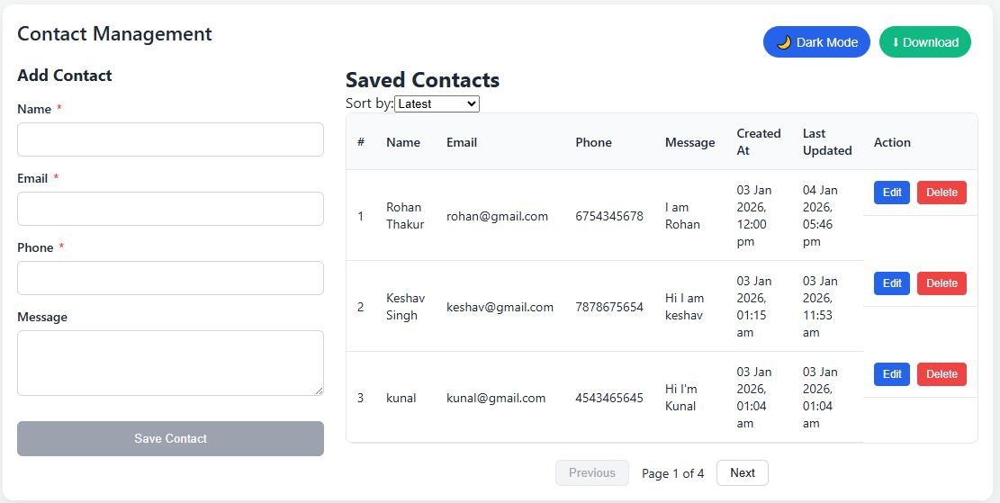
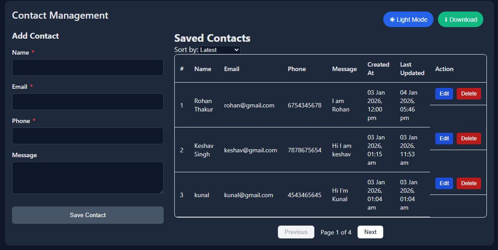

# Contact Management Application

A full-stack Contact Management web application built using the **MERN stack**.  
This application allows users to **add, view, update, delete, sort, and paginate contacts** without page reloads, following modern UI/UX and best development practices.

---

## Live Demo

- **Frontend:** https://contact-manager-kappa-kohl.vercel.app 

---

## Tech Stack

### Frontend
- React.js (Vite)
- Context API (Global State Management)
- Axios
- CSS (Responsive, Mobile-first)

### Backend
- Node.js
- Express.js
- MongoDB (Mongoose)
- RESTful APIs

### Deployment
- Frontend: **Vercel**
- Backend: **Render**
- Database: **MongoDB Atlas**

---

##  Features

- Add new contacts with validation
- View contacts in a paginated table
- Edit existing contact details
- Delete contacts with confirmation
- Real-time UI updates (no page reload)
- Correct serial numbering with pagination
- Created & last updated timestamps
- Sort contacts by **Latest** or **Name**
- Fully responsive (mobile, tablet, desktop)
- Success & error notifications

---

##  UI/UX Highlights

- Clean and minimal interface
- Sticky table headers
- Mobile-friendly layout
- Disabled buttons on invalid input
- Clear validation messages
- Optimized spacing and alignment

---

## How to Run Locally:
# 1.Clone the repository

# 2.After cloning the repo:
  cd contact-manager

# 3.Start Backend:
   cd backend
   npm install
   npm start

# 4.Start Frontend
   cd frontend
   npm install
    npm run dev

 Validations Implemented:

   1.Name: Minimum 3 characters

   2.Email: Valid email format

   3.Phone: Minimum 10 digits

   4.Submit disabled until form is valid

Pagination Logic:

    1.Backend-controlled pagination

    2.Dynamic total pages

    3.Correct serial numbering across pages

    4.Works correctly with sorting

Security & Best Practices:

    1.Environment variables for sensitive data

    2.No hardcoded URLs

    3.CORS configured properly

    4.Clean separation of concerns

## Project Screenshots

###  Dashboard

### CRUD operations

### Dark Mode

Developer:

  Sahil Kumar
  Full-Stack Developer

